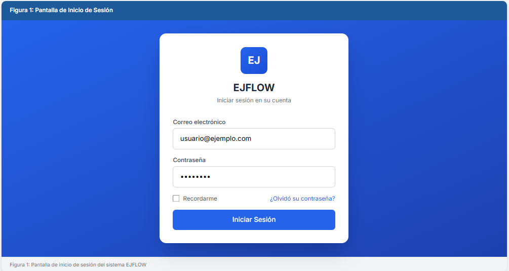
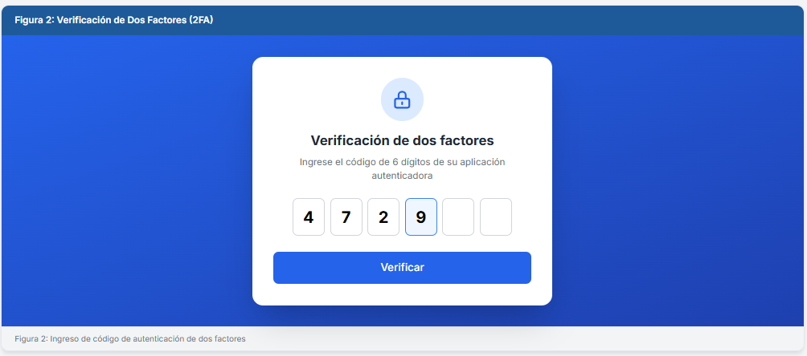
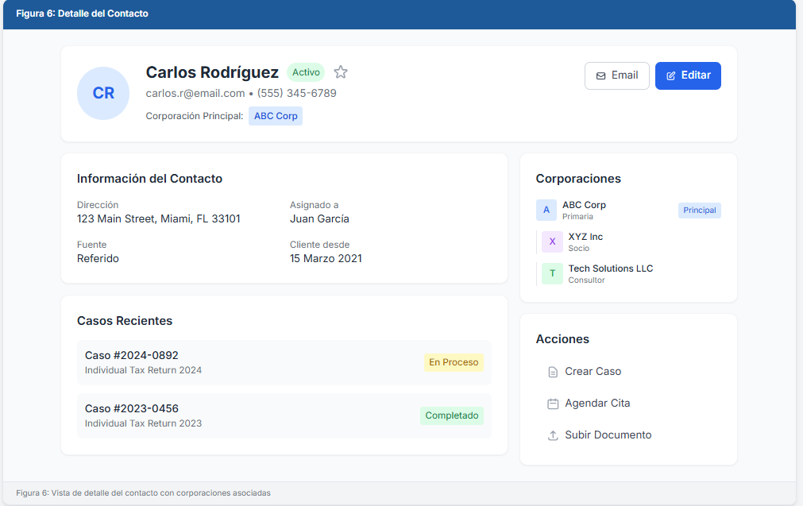
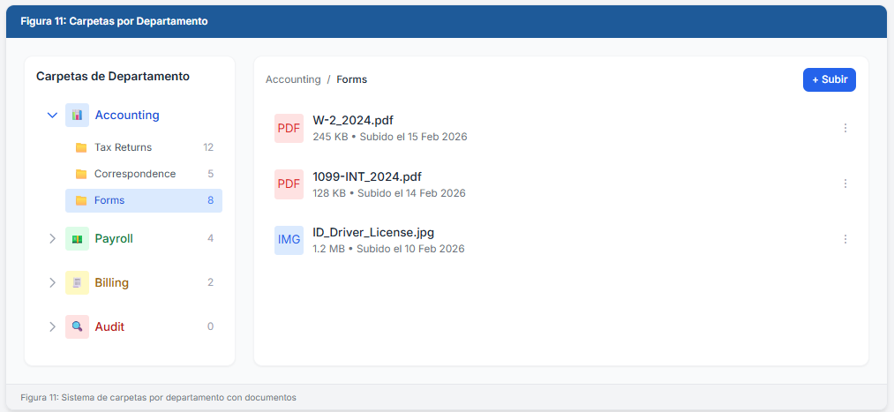

# EJFLOW Client
## Manual del Cliente

**Versión:** 1.1
**Fecha:** Febrero 2026

---

## Tabla de Contenidos

1. [Bienvenido al Portal](#bienvenido-al-portal)
2. [Acceso al Portal](#acceso-al-portal)
3. [Panel Principal](#panel-principal)
4. [Mis Casos](#mis-casos)
5. [Documentos](#documentos)
6. [Mensajes](#mensajes)
7. [Citas](#citas)
8. [Facturación](#facturación)
9. [Propiedades en Alquiler](#propiedades-en-alquiler)
10. [Mi Perfil](#mi-perfil)
11. [Asistente Virtual](#asistente-virtual)
12. [Preguntas Frecuentes](#preguntas-frecuentes)

---

## Bienvenido al Portal

Bienvenido a **EJFLOW Client**, el portal de clientes de Ebenezer Tax Services. Este portal le permite:

- Ver el estado de sus casos de impuestos
- Subir y descargar documentos
- Comunicarse con su preparador
- Programar citas
- Recibir notificaciones importantes


**Figura 1:** Portal de acceso EJFLOW Client

---

## Acceso al Portal

### Primer Acceso

1. Recibirá un correo electrónico con sus credenciales
2. Haga clic en el enlace proporcionado
3. Ingrese su correo electrónico y contraseña temporal
4. Se le pedirá crear una nueva contraseña

### Iniciar Sesión

1. Navegue a la URL del portal proporcionada
2. Ingrese su **correo electrónico**
3. Ingrese su **contraseña**
4. Haga clic en **"Iniciar Sesión"**


**Figura 2:** Pantalla de inicio de sesión

### Verificación de Dos Factores (2FA)

Si tiene 2FA habilitado para mayor seguridad:

1. Abra su aplicación autenticadora (Google Authenticator, Authy)
2. Ingrese el código de 6 dígitos
3. El código se actualiza cada 30 segundos


**Figura 3:** Pantalla de verificación de dos factores

### ¿Olvidó su Contraseña?

1. Haga clic en **"¿Olvidó su contraseña?"**
2. Ingrese su correo electrónico registrado
3. Revise su bandeja de entrada (y carpeta de spam)
4. Siga el enlace para crear una nueva contraseña

---

## Panel Principal

Al iniciar sesión, verá su panel principal con un resumen de su información.


**Figura 4:** Panel principal del portal

### Secciones del Panel

| Sección | Descripción |
|---------|-------------|
| **Casos Activos** | Número de casos en proceso |
| **Documentos Pendientes** | Documentos que necesita subir |
| **Mensajes Nuevos** | Mensajes sin leer de su preparador |
| **Próxima Cita** | Su próxima cita programada |

### Notificaciones

Las notificaciones aparecen en la campana (🔔) en la parte superior:

- Actualizaciones de estado de casos
- Solicitudes de documentos
- Mensajes nuevos
- Recordatorios de citas

---

## Mis Casos

### Ver Mis Casos

1. Haga clic en **"Mis Casos"** en el menú
2. Verá una lista de todos sus casos de impuestos


**Figura 5:** Lista de casos del cliente

### Estados del Caso

| Estado | Significado |
|--------|-------------|
| 🔵 **Nuevo** | Caso recién creado |
| 🟡 **En Proceso** | Su preparador está trabajando en él |
| 🟠 **En Revisión** | Siendo revisado por un supervisor |
| 🟣 **Listo para Enviar** | Preparado, esperando su aprobación |
| 🟢 **Enviado** | Enviado al IRS |
| ⚫ **Completado** | Proceso finalizado |

### Ver Detalle de un Caso

1. Haga clic en el caso que desea ver
2. Verá información detallada:
   - Año fiscal
   - Tipo de declaración
   - Preparador asignado
   - Documentos del caso
   - Historial de actividades


**Figura 6:** Vista detallada de un caso

---

## Documentos

### Ver Mis Documentos

1. Haga clic en **"Documentos"** en el menú
2. Los documentos están organizados por carpetas


**Figura 7:** Sistema de carpetas de documentos

### Carpetas Disponibles

| Carpeta | Contenido |
|---------|-----------|
| **Tax Returns** | Declaraciones de impuestos |
| **W-2 / 1099** | Formularios de ingresos |
| **Receipts** | Recibos y comprobantes |
| **Correspondence** | Cartas del IRS |
| **Other** | Otros documentos |

### Subir un Documento

1. Navegue a la carpeta correspondiente
2. Haga clic en **"Subir Documento"** o arrastre el archivo
3. Seleccione el archivo desde su computadora
4. Agregue una descripción (opcional)
5. Haga clic en **"Subir"**

**Formatos aceptados:** PDF, JPG, PNG, DOC, DOCX, XLS, XLSX

**Tamaño máximo:** 25 MB por archivo

### Descargar un Documento

1. Localice el documento en la lista
2. Haga clic en el ícono de descarga (⬇️)
3. El archivo se guardará en su carpeta de descargas

### Ver un Documento

1. Haga clic en el nombre del documento
2. Se abrirá una vista previa
3. Puede hacer zoom y navegar por las páginas

---

## Mensajes

### Bandeja de Mensajes

La sección de mensajes le permite comunicarse directamente con su equipo de preparadores.

1. Haga clic en **"Mensajes"** en el menú
2. Verá sus conversaciones

### Enviar un Mensaje

1. Haga clic en **"Nuevo Mensaje"**
2. Seleccione el caso relacionado (opcional)
3. Escriba su mensaje
4. Adjunte archivos si es necesario
5. Haga clic en **"Enviar"**

### Adjuntar Archivos

1. Haga clic en el ícono de clip (📎)
2. Seleccione el archivo
3. El archivo se adjuntará al mensaje

### Responder un Mensaje

1. Abra la conversación
2. Escriba su respuesta en el campo de texto
3. Haga clic en **"Enviar"**

---

## Citas

### Ver Mis Citas

1. Haga clic en **"Citas"** en el menú
2. Verá un calendario con sus citas programadas

### Tipos de Citas

| Tipo | Descripción |
|------|-------------|
| **Presencial** | En la oficina |
| **Virtual** | Por videoconferencia (Zoom/Google Meet) |
| **Telefónica** | Llamada telefónica |

### Solicitar una Cita

1. Haga clic en **"Solicitar Cita"**
2. Seleccione el tipo de cita
3. Elija fecha y hora disponible
4. Agregue notas (opcional)
5. Confirme la solicitud

### Cancelar o Reprogramar

1. Localice la cita en su calendario
2. Haga clic en la cita
3. Seleccione **"Cancelar"** o **"Reprogramar"**
4. Si reprograma, elija nueva fecha/hora

**Nota:** Cancelaciones con menos de 24 horas pueden estar sujetas a cargos.

---

## Facturación

El módulo de facturación le permite gestionar sus facturas, cotizaciones, productos y servicios.

### Panel de Facturación

1. Haga clic en **"Facturación"** en el menú
2. Verá un resumen con:
   - **Ingresos Totales** - Total de facturas pagadas
   - **Este Mes** - Ingresos del mes actual
   - **Pendiente** - Monto en facturas por cobrar
   - **Vencido** - Facturas pasadas de fecha

### Ver Facturas

1. Haga clic en **"Facturación"** > **"Facturas"**
2. Use los filtros para buscar:
   - **Búsqueda** - Por número o descripción
   - **Estado** - Borrador, Enviada, Pagada, Parcial, Vencida, Cancelada

### Estados de Facturas

| Estado | Significado |
|--------|-------------|
| 🔘 **Borrador** | Factura en preparación |
| 🔵 **Enviada** | Factura enviada al cliente |
| 🟢 **Pagada** | Factura completamente pagada |
| 🟡 **Parcial** | Pago parcial recibido |
| 🔴 **Vencida** | Factura pasada de fecha de pago |
| ⚫ **Cancelada** | Factura anulada |

### Crear Nueva Factura

1. Haga clic en **"Nueva Factura"**
2. Complete la información:
   - Cliente
   - Fecha de factura
   - Fecha de vencimiento
   - Asunto/Descripción
3. Agregue líneas de productos o servicios
4. Revise el total
5. Guarde como **Borrador** o **Envíe** directamente

### Ver Detalle de Factura

1. Haga clic en el ícono de ojo (👁️) de la factura
2. Verá:
   - Información del cliente
   - Detalle de productos/servicios
   - Subtotal, impuestos y total
   - Historial de pagos

### Descargar Factura

1. Abra el detalle de la factura
2. Haga clic en **"Descargar PDF"**
3. El archivo se guardará en su carpeta de descargas

### Cotizaciones

Las cotizaciones funcionan similar a las facturas pero son propuestas de precio:

1. Vaya a **"Facturación"** > **"Cotizaciones"**
2. Cree una nueva cotización
3. Una vez aprobada, puede convertirla en factura

---

## Propiedades en Alquiler

Este módulo le permite llevar el control de ingresos y gastos de sus propiedades en alquiler con una vista mensual tipo hoja de cálculo.

### Panel de Propiedades

1. Haga clic en **"Propiedades en Alquiler"** en el menú
2. Verá un resumen del año actual:
   - **Total Ingresos** - Renta cobrada
   - **Total Gastos** - Gastos de las propiedades
   - **Ganancia Neta** - Ingresos menos gastos

### Ver Lista de Propiedades

La página principal muestra tarjetas con cada propiedad:

- Nombre y dirección
- Tipo de propiedad (Residencial, Comercial, Multi-familiar, Uso Mixto)
- Número de unidades
- Resumen YTD (Año Hasta la Fecha):
  - Ingresos
  - Gastos
  - Ganancia

### Agregar Nueva Propiedad

1. Haga clic en **"Agregar Propiedad"**
2. Complete la información:
   - **Nombre** - Nombre de identificación (ej: "123 Main Street")
   - **Dirección** - Calle, Ciudad, Estado, Código Postal
   - **Tipo** - Residencial, Comercial, Multi-familiar, Uso Mixto
   - **Número de Unidades** - Cantidad de unidades rentables
   - **Fecha de Compra** - Opcional
   - **Precio de Compra** - Opcional
3. Haga clic en **"Guardar"**

### Vista Mensual (Grid)

Al hacer clic en una propiedad, verá la vista de resumen mensual:

```
┌─────────────────┬─────┬─────┬─────┬───┬─────┬───────────┐
│ CATEGORÍA       │ ENE │ FEB │ MAR │...│ DIC │ TOTAL AÑO │
├─────────────────┼─────┼─────┼─────┼───┼─────┼───────────┤
│ INGRESOS        │1200 │1200 │1200 │   │1200 │   14400   │
├─────────────────┼─────┼─────┼─────┼───┼─────┼───────────┤
│ GASTOS          │     │     │     │   │     │           │
│ HIPOTECA        │ 800 │ 800 │ 800 │   │ 800 │    9600   │
│ IMPUESTOS       │   0 │   0 │2400 │   │   0 │    2400   │
│ REPARACIONES    │ 150 │   0 │   0 │   │   0 │     150   │
│ ...             │     │     │     │   │     │           │
├─────────────────┼─────┼─────┼─────┼───┼─────┼───────────┤
│ TOTAL GASTOS    │ 950 │ 800 │3200 │   │ 800 │   12150   │
│ FLUJO NETO      │ 250 │ 400 │-2000│   │ 400 │    2250   │
└─────────────────┴─────┴─────┴─────┴───┴─────┴───────────┘
```

**Colores:**
- 🟢 Verde = Valores positivos (ingresos, ganancia)
- 🔴 Rojo = Valores negativos (gastos, pérdida)

### Agregar Transacción (Ingreso o Gasto)

**Método 1: Hacer clic en una celda**

1. Haga clic en cualquier celda del grid mensual
2. Se abrirá un formulario modal
3. Complete los datos:
   - **Tipo** - Ingreso o Gasto
   - **Categoría** - Solo para gastos (Hipoteca, Reparaciones, etc.)
   - **Monto** - Cantidad en dólares
   - **Descripción** - Opcional
4. Haga clic en **"Guardar"**

### Categorías de Gastos

El sistema incluye categorías predefinidas:

| Categoría | Descripción |
|-----------|-------------|
| MORTGAGE | Pago de hipoteca |
| PROPERTY TAXES | Impuestos de propiedad |
| HOME INSURANCE | Seguro del hogar |
| ELECTRIC | Electricidad |
| WATER | Agua |
| GAS | Gas |
| INTERNET | Internet |
| REPAIRS | Reparaciones |
| MAINTENANCE | Mantenimiento |
| LANDSCAPING/SNOW | Jardinería/Nieve |
| CLEANING | Limpieza |
| APPLIANCES | Electrodomésticos |
| PEST CONTROL | Control de plagas |
| HOA FEES | Cuotas de asociación |
| MANAGEMENT FEES | Honorarios de administración |
| LEGAL/PROFESSIONAL | Legal/Profesional |
| ADVERTISING | Publicidad |
| SUPPLIES | Suministros |
| OTHER | Otros |

### Ver Lista de Transacciones

1. Haga clic en **"Transacciones"** en la barra de acciones
2. Verá todas las transacciones en formato de lista
3. Puede filtrar por:
   - Tipo (Ingreso/Gasto)
   - Categoría
   - Rango de fechas

### Editar o Eliminar Transacción

1. Vaya a la lista de transacciones
2. Haga clic en la transacción que desea modificar
3. Edite los datos o haga clic en **"Eliminar"**

### Seleccionar Año

1. Use el selector de año en la esquina superior derecha
2. Puede ver datos de los últimos 6 años

### Exportar Datos

**Exportar a PDF:**
1. Haga clic en el botón **"PDF"**
2. Se generará un reporte profesional con:
   - Resumen de la propiedad
   - Tabla mensual de ingresos y gastos
   - Totales anuales

**Exportar a CSV:**
1. Haga clic en el botón **"CSV"**
2. Se descargará un archivo compatible con Excel
3. Útil para análisis adicional o reportes fiscales

**Imprimir:**
1. Haga clic en el botón **"Imprimir"**
2. Se abrirá el diálogo de impresión del navegador
3. La página está optimizada para impresión

### Editar Propiedad

1. Haga clic en el ícono de engranaje (⚙️)
2. Modifique los datos de la propiedad
3. Haga clic en **"Guardar"**

---

## Mi Perfil

### Ver Mi Información

1. Haga clic en su nombre (esquina superior derecha)
2. Seleccione **"Mi Perfil"**

### Actualizar Información

Puede actualizar:
- Número de teléfono
- Dirección
- Preferencias de comunicación

**Nota:** Para cambiar su correo electrónico, contacte a su preparador.

### Cambiar Contraseña

1. Vaya a **"Mi Perfil"** > **"Seguridad"**
2. Ingrese su contraseña actual
3. Ingrese la nueva contraseña (2 veces)
4. Haga clic en **"Guardar"**

**Requisitos de contraseña:**
- Mínimo 8 caracteres
- Al menos una mayúscula
- Al menos un número
- Al menos un carácter especial

### Habilitar 2FA

Para mayor seguridad:

1. Vaya a **"Mi Perfil"** > **"Seguridad"**
2. Haga clic en **"Habilitar 2FA"**
3. Escanee el código QR con su aplicación autenticadora
4. Ingrese el código de verificación
5. Guarde los códigos de respaldo

---

## Asistente Virtual

### Chatbot 24/7

El asistente virtual está disponible las 24 horas para ayudarle con:

- Preguntas frecuentes
- Estado de sus casos
- Información sobre documentos requeridos
- Horarios de oficina
- Información de contacto

### Cómo Usar el Asistente

1. Haga clic en el ícono de chat (💬) en la esquina inferior derecha
2. Escriba su pregunta
3. El asistente responderá inmediatamente

### Ejemplos de Preguntas

- "¿Cuál es el estado de mi caso?"
- "¿Qué documentos necesito para mi declaración?"
- "¿Cuál es el horario de oficina?"
- "¿Cómo puedo programar una cita?"

**Nota:** Para consultas específicas sobre su situación fiscal, el asistente le conectará con un representante.

---

## Preguntas Frecuentes

### Acceso y Cuenta

**P: ¿Qué hago si no recibí el correo de activación?**
R: Revise su carpeta de spam. Si no lo encuentra, contacte a su preparador para reenviar la invitación.

**P: ¿Puedo acceder desde mi teléfono?**
R: Sí, el portal es compatible con dispositivos móviles. También puede descargar la app EJFLOW Client.

**P: ¿Mi información está segura?**
R: Sí, utilizamos encriptación de nivel bancario y cumplimos con las regulaciones de privacidad.

### Documentos

**P: ¿Qué documentos necesito subir?**
R: Depende de su situación. Revise la sección "Documentos Pendientes" en su panel o consulte con su preparador.

**P: ¿Puedo eliminar un documento subido?**
R: No directamente. Contacte a su preparador si subió un documento por error.

**P: ¿Cuánto tiempo se guardan mis documentos?**
R: Sus documentos se almacenan de forma segura por 7 años, según las regulaciones del IRS.

### Casos

**P: ¿Por qué mi caso dice "En Espera"?**
R: Generalmente significa que falta información o documentos. Revise sus notificaciones o mensajes.

**P: ¿Cuánto tiempo toma procesar mi declaración?**
R: El tiempo varía según la complejidad. Su preparador le dará un estimado.

### Pagos y Facturación

**P: ¿Cómo puedo pagar los servicios?**
R: Puede pagar en línea con tarjeta de crédito/débito, o en persona en la oficina.

**P: ¿Puedo ver mis facturas en el portal?**
R: Sí, en la sección "Facturación" puede ver y descargar sus facturas en formato PDF.

**P: ¿Qué significan los diferentes estados de factura?**
R: Borrador (en preparación), Enviada (pendiente de pago), Pagada (completamente pagada), Parcial (pago parcial recibido), Vencida (pasada la fecha de pago), Cancelada (anulada).

**P: ¿Cómo descargo una factura?**
R: Abra el detalle de la factura y haga clic en "Descargar PDF".

### Propiedades en Alquiler

**P: ¿Cómo agrego una propiedad en alquiler?**
R: Vaya a "Propiedades en Alquiler" y haga clic en "Agregar Propiedad". Complete los datos de dirección, tipo y número de unidades.

**P: ¿Cómo registro un pago de renta?**
R: Haga clic en la propiedad, luego en la celda del mes correspondiente en la fila "INGRESOS". Complete el monto y guarde.

**P: ¿Cómo registro un gasto de la propiedad?**
R: Haga clic en la celda correspondiente a la categoría del gasto (ej: HIPOTECA, REPARACIONES) y el mes. Complete el monto y descripción.

**P: ¿Puedo agregar mis propias categorías de gastos?**
R: El sistema incluye categorías predefinidas que cubren la mayoría de gastos comunes. Contacte a su preparador si necesita categorías adicionales.

**P: ¿Cómo exporto los datos para mis impuestos?**
R: Use el botón "CSV" o "PDF" en la vista de la propiedad para exportar el resumen anual. El archivo CSV es compatible con Excel.

**P: ¿Cómo veo el resumen de años anteriores?**
R: Use el selector de año en la esquina superior derecha de la vista de propiedad. Puede ver los últimos 6 años.

**P: ¿Qué es el "Flujo Neto"?**
R: Es la diferencia entre los ingresos (renta) y los gastos totales de la propiedad. Un número verde positivo indica ganancia, rojo indica pérdida.

---

## Contacto

### Información de Contacto

- **Email:** jhoelp@supportit.com
- **Teléfono:** (347) 854-5662
- **Horario:** Lunes a Viernes, 9:00 AM - 6:00 PM EST

### Oficina Principal

Ebenezer Tax Services
[Dirección de la oficina]

### Soporte Técnico

Si tiene problemas técnicos con el portal:
- **Email:** jhoelp@supportit.com
- **Chat:** Use el asistente virtual

---

## Consejos de Seguridad

1. **No comparta sus credenciales** con nadie
2. **Use contraseñas fuertes** y únicas
3. **Habilite 2FA** para mayor protección
4. **Cierre sesión** al terminar, especialmente en dispositivos compartidos
5. **Verifique la URL** antes de ingresar sus datos
6. **No responda** a correos sospechosos pidiendo información

---

**© 2026 Ebenezer Tax Services. Todos los derechos reservados.**

**EJFLOW** es una marca registrada de E & J Support IT.
